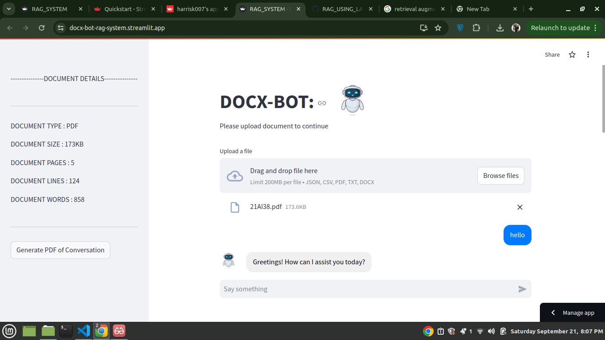

# DCOUMENT-RAG-USING-LANGCHAIN

-----DONT FORGET TO ADD YOUR GEMINI API KEY iN CONFIG FILE BEFORE USING IT----------

🔥 Swamped by endless reading? Let DOCX-BOT turn your document chaos into crystal-clear clarity in seconds!

I’m thrilled to share my latest project: DOCX-BOT, a cutting-edge RAG (Retrieval-Augmented Generation) system combined with an interactive chatbot! This innovative tool allows users to seamlessly interact with documents and receive insightful responses.

🚀 Key Features of DOCX-BOT:

📁 Multi-Format Support: Upload documents in various formats (TXT, CSV, JSON, PDF, DOCX) and extract valuable information effortlessly.

📊 Metadata Extraction: Automatically fetch and display essential document metadata, including type, size, page count, lines, and word count.

💬 Interactive Chatbot: Engage with DOCX-BOT through intuitive conversations. Ask questions related to the document, and get intelligent responses powered by the RAG model!

📜 PDF Export: Keep track of your interactions! Generate and download a PDF of the entire chat history, formatted for clarity and ease of reference.
✨ User-Friendly Interface: Built using Streamlit, DOCX-BOT provides a smooth and interactive user experience.

This project represents a significant step in my journey as a developer, blending document processing with AI-driven conversation. I’m excited to continue enhancing DOCX-BOT with even more features in the future!

🔗 Check it out 
streamlit live demo : https://docx-bot-rag-system.streamlit.app
and let me know what you think! Feedback is always welcome! 🙌
